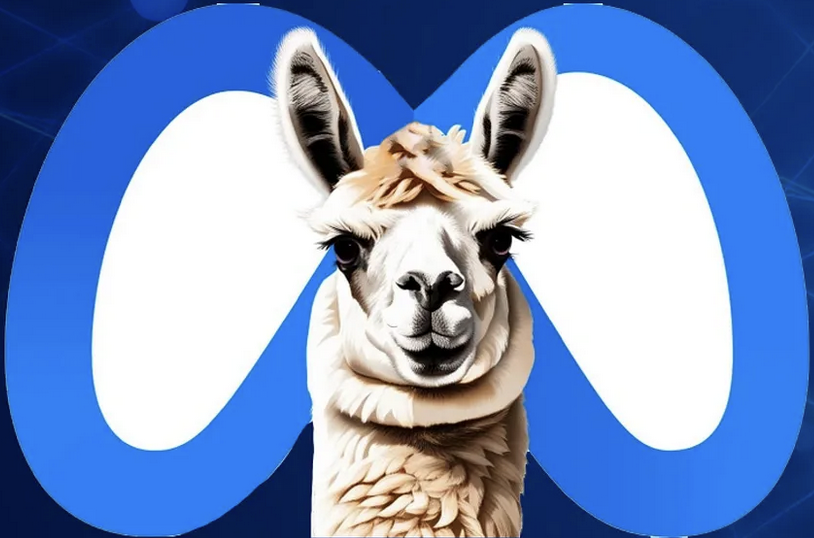

  

<h1 align="center">MD SHAFIQUL ISLAM</h1>
<h3 align="center">AI Engineer | Japan 🇯🇵</h3>

I'm an **AI Engineer based in Japan**, specializing in the development of **real-world AI applications** using **Large Language Models (LLMs)**, **Retrieval-Augmented Generation (RAG)** systems, **Python**, and **Point Cloud Processing**. My work spans a diverse range of solutions—from intelligent document Q&A systems to automated 3D model generation pipelines. I’m currently focused on building **end-to-end GenAI applications**, leveraging tools like **ChatGPT**, **LangChain**, and custom-built components to deliver scalable, production-ready solutions.

## 💼 What I Do

- 🔍 Build custom **Retrieval-Augmented Generation (RAG)** pipelines using ChromaDB, Pinecone, or Qdrant
- 🧠 Develop **ReAct Agents** from scratch (no framework) using Python and OpenAI
- 🌐 Design full-stack **AI-powered web apps** using Streamlit or FastAPI
- 🧱 Process and analyze **3D point cloud data** for industrial applications (e.g., stockpile volume estimation)
- 🔒 Secure deployments with **Docker**, `.env` handling, and **Azure**

## 🔧 Tech Stack

### 💻 Language & ML Framework

| Python                                    | Java                                    | Pytorch                                    | TensorFlow                                    |
|-------------------------------------------|-----------------------------------------|--------------------------------------------|-----------------------------------------------|
|  |  |  |  |

### 🧠 Large Language Model (LLM)

| ChatGPT                                    | Gemini                                    | LLama                                    | Claude                                    | Mistral                                    |
|--------------------------------------------|-------------------------------------------|------------------------------------------|-------------------------------------------|--------------------------------------------|
|  |  |  |  |  |

### 🧩 LLM Framework

| LlamaIndex                                    | LangChain                                    | CrewAI                                    | LangGraph                                    |
|-----------------------------------------------|----------------------------------------------|-------------------------------------------|----------------------------------------------|
|  |  |  |  |

### 🗄️ Database
| Qdrant                                    | ChromaDB                                    | Pinecone                                    | Weaviate                                    | MySQL                                    | PostgreSQL                                    | Neo4j                                    |
|-------------------------------------------|---------------------------------------------|---------------------------------------------|---------------------------------------------|------------------------------------------|-----------------------------------------------|------------------------------------------|
|  |  |  |  |  |  |  |

### 🎨 FrontEnd
| Gradio                                    | Streamlit                                    |
|-------------------------------------------|----------------------------------------------|
|  |  |

### 👁️ Computer Vision

| OpenCV                                    | Open3D                                    | Point Cloud                                    | OCR                                    | YOLO                                    | Object  Detection                             | Object  Segmentation                         |
|-------------------------------------------|-------------------------------------------|------------------------------------------------|----------------------------------------|-----------------------------------------|--------------------------------------------------|-------------------------------------------------|
|  |  |  |  |  |  |  |

 

### ⚙️ DevOps

| Docker                                    | Git                                    | Linux                                    | CircleCI                                    |
|-------------------------------------------|----------------------------------------|------------------------------------------|---------------------------------------------|
|  |  |  |  |

| Azure                                    | GCP                                    | AWS                                    |
|------------------------------------------|----------------------------------------|----------------------------------------|
|  |  |  |

## 🚀 Featured Projects

- 🔧 [**ReAct-Agent-from-Scratch**](https://github.com/shafiqul-islam-sumon/ReAct-Agent-from-Scratch): Framework-free ReAct agent with calculator, Wikipedia, web search, and GUI via Streamlit.
- 🔒 [**SecureDockerEnv**](https://github.com/shafiqul-islam-sumon/SecureDockerEnv): Secure Docker secrets handling for `.env` credentials.
- 🧠 [**LLM Knowledge Extractor**](https://github.com/shafiqul-islam-sumon/LLM-Knowledge-Extractor): Extract Q&A from messy PDFs using LangChain + Azure OpenAI.

## 📄 Publications

- **[Evaluation of Transfer Learning for Human Activity Recognition among Different Datasets](https://ieeexplore.ieee.org/abstract/document/8890445)**  
  *IEEE PICom | International Conference on Pervasive Intelligence and Computing (2019)*  
  

- **[Human Activity Recognition using Earable Device](https://dl.acm.org/doi/10.1145/3341162.3343822)**  
  *UbiComp/ISWC | ACM International Joint Conference on Pervasive and Ubiquitous Computing (2019)*  
  

- **[Exploring Human Activities Using eSense Earable Device](https://link.springer.com/chapter/10.1007/978-981-15-8944-7_11)**  
  *ABC | Activity and Behavior Computing (ABC) (2020)*  
  

## ✍️ Blog & Portfolio

  Visit my portfolio and AI blog: 
  <a href="https://shafiqulai.github.io" target="_blank">
    
    <strong>https://shafiqulai.github.io</strong>
  </a>

## 📫 Let's Connect

  
  &nbsp;&nbsp;&nbsp;&nbsp;
  
  &nbsp;&nbsp;&nbsp;&nbsp;
  
  &nbsp;&nbsp;&nbsp;&nbsp;
  

## 📊 GitHub Stats

<table style="border: none;">
  <tr style="border: none;">
    <td style="border: none;">
      
    </td>
    <td style="width: 40px; border: none;"></td> <!-- This is the horizontal space -->
    <td style="border: none;">
      
    </td>
  </tr>
</table>

  

